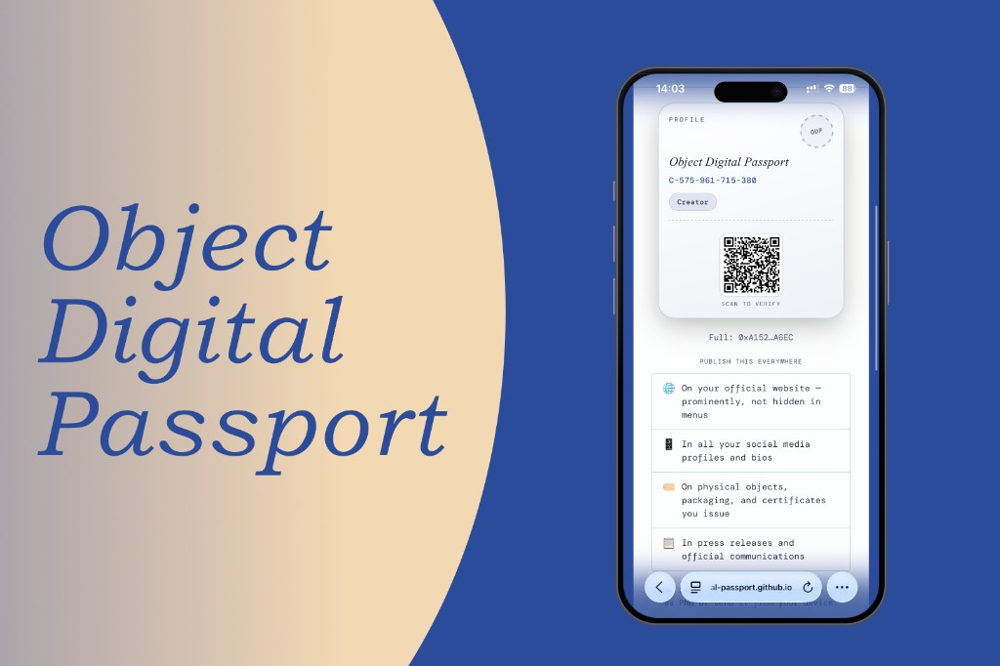

# Object Digital Passport · v0.4

[](LICENSE)
[](https://github.com/object-digital-passport/object-digital-passport/stargazers)

## What ODP is

**Object Digital Passport (ODP)** is an **open standard for object authenticity**. It can describe **almost anything** — physical items, digital works, collectibles, and more: the standard is not tied to one industry.

**It is built on a blockchain.** And no: this is not “another NFT project” or a meme coin. In plain terms, a **blockchain** is a chain of **information blocks** linked so the network can verify the chain is intact; a record that lands in a public registry **cannot be erased retroactively** as if it never existed — that is what makes later checks meaningful. The registry itself is still **not locked** to one company, subscription, or private gatekeeper for the index.

**Who it is for.** ODP is for **solo creators and makers** and for **organizations**: brands, galleries, museums, and expert institutions. Organizations get **proofs**, optional **parent/child affiliation**, and profile **types** in the registry (**C / B / P / M** — see [Quick Start](#quick-start-5-minutes)). Normative detail is in [SPEC.md](SPEC.md).

## Languages and translations


|                            |                                                        |
| -------------------------- | ------------------------------------------------------ |
| 🇬🇧 **English**           | You are reading the main README.                       |
| 🇷🇺 **Russian / Русский** | [localization/ru/README.md](localization/ru/README.md) |


**We welcome README and UI translations in any language.** Add files under `localization/<language-code>/` (see the [localization/ru/](localization/ru/) layout). Open a **[Pull Request](https://github.com/object-digital-passport/object-digital-passport/pulls)** or an **[Issue](https://github.com/object-digital-passport/object-digital-passport/issues)** — maintainers will review. Guidelines: **[CONTRIBUTING.md](CONTRIBUTING.md)** (editing, localization, and how to propose changes).

**Help us:** translate, share the **[project link](https://github.com/object-digital-passport/object-digital-passport)**, or tell communities who might care about open provenance for objects.

---

## Positioning

ODP does **not** replace human expertise, institutional provenance work, or other standards. It is meant to complement them — for example **digital product passport (DPP)** programmes, **GS1** data, **IIIF** media delivery, and **C2PA** content credentials (see [SPEC.md](SPEC.md) §18 for narrative alignment). One design idea is a **verifiable registry**: verification can show which deployment and rules produced a record, alongside checks on file integrity.

**Spam and abuse:** requiring writes on-chain is partly a sketch for reducing noise in a shared index, but the right balance for a stable product is still open — expect this to evolve before a stable release.

**Interfaces:** this specification does **not** normatively define visual design for apps or sites; that can be revisited with the community toward stability.

## How ODP Works

**In plain terms:** you register **who is issuing** once (a profile), then create a **passport** for each object. The chain stores a **fingerprint** of your file—plus an optional **public link** to the **§15 `.odpass`** ZIP (not bare JSON at that URL)—not the whole story inside the transaction. To verify, someone opens [Verify](https://object-digital-passport.github.io/object-digital-passport/verify.html), compares the file to the registry, and **does not need a wallet**.

**Four steps in order**

1. **Profile.** You sign up as yourself or an organization and get a lasting **Profile ID** with a letter prefix (**C / B / P / M**) so the role is clear at a glance.
2. **Object passport.** You fill in the form and confirm on-chain. The registry stores **hashes**, an optional **public file URL**, and metadata per **[SPEC.md](SPEC.md)**—that ties “this passport” to “this deployment” (e.g. **v0.4** / **v0.3**-style `ObjectDigitalPassport` contracts).
3. **What to share.** People usually pass along the **Passport ID** (`ODP-…`) and, when needed, the `**.odpass`** file, **raw `passport.json`** offline, or a **public HTTPS URL** that serves the **§15 `.odpass`** ZIP (not bare JSON at that URL), so anyone can obtain bytes and check them against `**dataHash**`.
4. **Verification.** Anyone (or any tool) takes **your file or link**, reads **public** chain state, and checks that the content **matches** what was committed. That is read-only for the verifier—no permission to edit the registry.

**Public profile identity is mandatory.** Participants (**C / B / P / M**) **must** publish their **short Profile ID** together with the **full wallet address** (0x…). This is a **protocol requirement**, not etiquette: otherwise on-chain data looks anonymous and you **cannot tell** honest issuance from **spam** or impersonation. When the same **short ID** and **wallet** appear on your official site and other channels, a verifier can see the record was made by a **real** person or organisation—not an arbitrary address. Normative wording and examples are in **[SPEC.md](SPEC.md)** (Public identity requirement).

**Where to publish (same principles as in the spec and on-site copy):**

- On your **official website** — prominently, not buried in navigation.
- In **public social** profiles and bios.
- On **packaging, certificates**, labels — where it makes sense.
- In any other **public channels you control** where users expect verification context.

**Both forms** (short ID and full address) must be **easy to find**. Brand or institution names are **not** stored in the contract—trust comes from **you** publishing your ID next to your brand. Example block for a page (as in SPEC / help markup):

```text
Creator on example.com:
  Short:  C-482-930-174-005
  Full:   0x742d35Cc…4438f44e

Museum on museum.com:
  Short:  M-204-839-112-441
  Full:   0xB3F924ee…1823A3c8A
```

**If you read JSON or code**

- The human-facing number is the **Passport ID** (`ODP-YYYY-MM-…`).
- In `**passport.json`**, the same value is field `**passportId`**.
- In low-level contract calls it may appear as `**humanId**`—same meaning, historic name.

---

## README vs the protocol

This README is mainly a **hands-on path** to **try the technology quickly** using our **[live demo pages](#live-demo)**. ODP itself is a **specification** you can **integrate however and wherever you want**—your own sites, apps, backends, or partner flows—so for integration details, **read [SPEC.md](SPEC.md)**.

You **do not** need deep blockchain expertise to try the **[live demo pages](#live-demo)**. Checking a passport is free and does not require a wallet. Issuing a profile or passport uses common browser wallets and a small network fee on Polygon (often on the order of **~US$0.01** per typical transaction—network load varies) — details are in [Start Here](#start-here) and [Quick Start](#quick-start-5-minutes).

**What is this website?** [GitHub](https://github.com/) is where we host the **open-source** specification, web pages, and tools. You can read everything for free, copy the project, or suggest improvements — no account is required just to read.

## Table of contents

**Getting started**

- [What ODP is](#what-odp-is)
- [Languages and translations](#languages-and-translations)
- [Positioning](#positioning)
- [How ODP Works](#how-odp-works)
- [README vs the protocol](#readme-vs-the-protocol)
- [Start Here](#start-here)
- [Quick Start (5 minutes)](#quick-start-5-minutes)
- [Live Demo](#live-demo)

**Technical reference**

- [Reference stack v0.4 (quick facts)](#reference-stack-v04-quick-facts)
- [Current Release](#current-release)
- [Terms You Need](#terms-you-need)
- [Security and Verification Model](#security-and-verification-model)
- [Costs and Network](#costs-and-network)
- [Roadmap](#roadmap)
- [Contributing](#contributing)
- [Author and License](#author-and-license)

## Start Here

If you are new, follow this order:

1. **Wallet.** You need a crypto wallet (browser extension or app) to write to the network. Use a **separate** wallet for experiments—not the one that holds your main savings. Save your recovery phrase and store it offline. When a site asks to “connect”, pause: that is normal for these pages, but scammers use the same trick—read **your** wallet’s help, e.g. [MetaMask](https://support.metamask.io/) or [Rabby](https://rabby.io/) (brand is not important). On **[Profile](https://object-digital-passport.github.io/object-digital-passport/creator.html)** and **[Passport](https://object-digital-passport.github.io/object-digital-passport/passport.html)** you can also sign from a phone via QR. You pay a small **network fee** (on Polygon that is usually **POL**); there is **no separate ODP protocol fee**—see [Costs and Network](#costs-and-network). If you **self-host** a copy of the site, you may need extra settings—see `[web/odp-wc-config.js](web/odp-wc-config.js)` and [RELEASE_v0.4.md](RELEASE_v0.4.md).
2. **This README.** Read it through for a practical “how to use” picture—no code required.
3. **Rules in full.** The normative protocol text is [SPEC.md](SPEC.md).
4. **Going deeper.** What is new in this line: [RELEASE_v0.4.md](RELEASE_v0.4.md). Earlier changes vs older lines: [RELEASE_v0.3.md](RELEASE_v0.3.md). To **deploy your own** registry (for developers): [deploy/README.md](deploy/README.md).

**Still early days.** ODP is in **development, testing, and gathering feedback**—rules and deployments can still change. We aim for a **stable 1.x release around January 2027** as the long-term baseline. If you need a **record meant to last many years** with minimal rule churn, **consider waiting for that stable release**. Each contract address is its **own** registry; records do **not** move between deployments by themselves. More on versioning: [docs/VERSIONING_AND_RELEASES.md](docs/VERSIONING_AND_RELEASES.md).

## Quick Start (5 minutes)

### 1) Prepare wallet and network fees

- A browser wallet (**MetaMask**, **Rabby**, Coinbase Wallet, Brave, etc.) **or** mobile: the Profile/Passport menu uses **[WalletConnect](https://docs.reown.com/)** (QR / app link). Examples include **Tangem**, MetaMask mobile, Rainbow, and other WalletConnect-compatible wallets.
- Keep a small **POL** balance—Polygon’s native token used for network fees.
- **Use a dedicated wallet for ODP**—not for long-term savings or trading (less risk if a site is malicious).

### 2) Register your profile

- Open [Profile](https://object-digital-passport.github.io/object-digital-passport/creator.html).
- Register once to receive your **profile ID** — a string starting with `**C-`**, `**B-`**, `**P-**`, or `**M-**` (you pick the type at registration; it does not change on its own later).

**What the letter means**


| Prefix                    | Typical use                     | In short                                                                                                   |
| ------------------------- | ------------------------------- | ---------------------------------------------------------------------------------------------------------- |
| **C** (Creator)           | Individual author, craft studio | Issue under your own name                                                                                  |
| **B** (Brand)             | Brand or company                | Issue as an organization                                                                                   |
| **P** (Proof institution) | Expert / curatorial institution | Can issue **proofs** for others; supports **affiliation** with child institutions                          |
| **M** (Museum)            | Museum or collection            | Curatorial flows; with **P**, can use extended checks (including concern in v0.4 — see [SPEC.md](SPEC.md)) |


Full rules for limits, proofs, and affiliation: [SPEC.md](SPEC.md).

### 3) Passport: create, confirm, keep your `.odpass` file

In short: you fill in the form, confirm once in your wallet, and **download** the bundle—without it, you don’t get a full verification story.

1. Open [Passport](https://object-digital-passport.github.io/object-digital-passport/passport.html) and complete the fields.
2. Confirm the transaction in your wallet—that **writes the passport on-chain** (a small network fee applies; there is no separate “ODP fee”).
3. **Download** the `**.odpass`** file on the success screen and **store it somewhere safe**. The demo **does not** keep your file: if you leave without saving, you cannot fetch the same package from this site later.

**What you downloaded.** A ZIP bundle per SPEC §15, named with a `**.odpass`** extension: the main file is `**passport.json`** (that content is hashed into `**dataHash`** on-chain), plus `**manifest.json`** and `**originals/`** for attachments—exact layout in **[SPEC.md](SPEC.md)**.

**Why the file matters.** The registry holds a **fingerprint**, not the full human-readable passport inside the transaction. To show text, images, and attachments—and to match `**dataHash`**—verifiers need the same bytes you had at issuance: your `**.odpass`** or **raw `passport.json`** offline. For **automatic fetch from the web**, the public `**dataUrl`** must serve the **§15 `.odpass`** ZIP—**not** bare JSON at that URL (see step 4 and **SPEC §9**). **Passport ID alone**, with no file, mostly yields **IDs and digests**—not a rich passport view.

**Public URL now or later.** In the form you can set an HTTPS `**dataUrl`** (**folder on your site**, **full file URL**, or **leave it blank**). Undecided? You can **add or change** `dataUrl` later with another transaction (“Update hosting links” on the Passport page).

### 4) Host the same file at a link (optional—helps strangers verify)

Use this when you want anyone to open [Verify](https://object-digital-passport.github.io/object-digital-passport/verify.html), enter `ODP-…`, and **automatically fetch** the passport from the web—without emailing a `.odpass` file.

- Whatever you put at `**dataUrl`** must return **the §15 `.odpass` ZIP** whose extracted `passport.json` matches `**dataHash`**—[Verify](https://object-digital-passport.github.io/object-digital-passport/verify.html) fetches that ZIP and does **not** treat a bare `.json` URL as valid hosting.
- The link must be **HTTPS** and return the **file itself**, not a login page, HTML shell, or a cloud “preview” that doesn’t serve raw bytes.
- After the URL is on-chain, **do not replace** the hosted file with different content—the hash will no longer match `**dataHash`**.

### 5) Verify

- Open [Verify](https://object-digital-passport.github.io/object-digital-passport/verify.html).
- Enter a Passport ID, paste an `odp://...` link, or drop a `**.odpass`** file.

## Live Demo

Base URL:

- [https://object-digital-passport.github.io/object-digital-passport/](https://object-digital-passport.github.io/object-digital-passport/)

Pages:

- Verify (no wallet): [verify.html](https://object-digital-passport.github.io/object-digital-passport/verify.html)
- Profile (wallet + network fees): [creator.html](https://object-digital-passport.github.io/object-digital-passport/creator.html)
- Passport (wallet + network fees): [passport.html](https://object-digital-passport.github.io/object-digital-passport/passport.html)

## Reference stack v0.4 (quick facts)

**This repository** (`main` branch) is the reference **v0.4** line: on-chain generation **4** when you deploy Solidity from here (`CONTRACT_VERSION` packed byte **4**), optional `ODPCounterfeitConcern` satellite, WalletConnect on static pages, and the slimmer main-registry ABI — see [RELEASE_v0.4.md](RELEASE_v0.4.md) and [SPEC.md](SPEC.md). **Default Polygon addresses** in this README and [deploy/deployments/polygon.json](deploy/deployments/polygon.json) match the **generation 4** deployment baked into the static pages’ `NET.*`; if you self-host, align **chain + contract address + ABI** with your deployment.


|                         |                                                                                                                                                                                                                  |
| ----------------------- | ---------------------------------------------------------------------------------------------------------------------------------------------------------------------------------------------------------------- |
| **Source**              | Branch `main` in this repository — reference **v0.4** stack (contracts + static web).                                                                                                                            |
| **On-chain generation** | `CONTRACT_VERSION` = **4** (same v0.3-shaped `Passport` tuple as generation **3**).                                                                                                                              |
| **New vs v0.3 line**    | Optional `ODPCounterfeitConcern` satellite (P/M concern); public `SPEC_*` / `MONTHLY_LIMIT_*` getters removed from the main contract bytecode for **EIP-170** headroom — see [RELEASE_v0.4.md](RELEASE_v0.4.md). |
| **Deploy order**        | `ODPPassportLib` → `ObjectDigitalPassport` → optional `ODPWalletDocumentAnchor` / `ODPCounterfeitConcern` — [deploy/README.md](deploy/README.md).                                                                |


## Current Release

Reference deployment (**Polygon mainnet**, `chainId` 137) for this repo’s static UI defaults:


| Item                                                           | Value                                                                                                                        |
| -------------------------------------------------------------- | ---------------------------------------------------------------------------------------------------------------------------- |
| Protocol line                                                  | **v0.4** — on-chain generation **4** (`CONTRACT_VERSION` packed byte **4**; same `Passport` tuple shape as generation **3**) |
| Main registry `ObjectDigitalPassport`                          | `[0x35c29A1faC6e39925BeF616bb5222F024E5D6132](https://polygonscan.com/address/0x35c29A1faC6e39925BeF616bb5222F024E5D6132)`   |
| Linked library `ODPPassportLib` (verification / bytecode link) | `[0x8D2f3C374CE5424E988aa8AEA93487A327f7450F](https://polygonscan.com/address/0x8D2f3C374CE5424E988aa8AEA93487A327f7450F)`   |
| Wallet document anchor `ODPWalletDocumentAnchor` (satellite)   | `[0xcb3AF1d0530ca1D8D78528E4ED93ac7C2eb64210](https://polygonscan.com/address/0xcb3AF1d0530ca1D8D78528E4ED93ac7C2eb64210)`   |
| Counterfeit concern `ODPCounterfeitConcern` (satellite)        | `[0x7C2EAaC6b0E4c14765d4064885A175fD057f680e](https://polygonscan.com/address/0x7C2EAaC6b0E4c14765d4064885A175fD057f680e)`   |


**Release notes:** `[RELEASE_v0.4.md](RELEASE_v0.4.md)` · **Earlier line (v0.3 vs v0.2):** `[RELEASE_v0.3.md](RELEASE_v0.3.md)`.

## Terms You Need


| Term            | Meaning in ODP                                                                  |
| --------------- | ------------------------------------------------------------------------------- |
| Register        | One-time profile registration (`registerCreator`)                               |
| Issue / mint    | Create a new passport record on-chain (user-facing “issue”; ABI may say *mint*) |
| Passport ID     | Human-readable object id (`ODP-...`)                                            |
| Profile ID      | Issuer identity (`C/B/P/M-...`)                                                 |
| `passport.json` | Canonical off-chain object document                                             |
| `dataUrl`       | Optional HTTPS location for that JSON or `**.odpass`** bundle                   |
| Verify          | Read-only checks (no wallet, no protocol fee)                                   |


## Security and Verification Model

For threat model and trust boundaries:

- `[SECURITY.md](SECURITY.md)`

Verification basics:

- On-chain hashes are the anchor for what was registered.
- `**passport.json`** (or the bytes inside `**.odpass`**) must match the stored `**dataHash`** (and related fields per spec).
- `**manifest.json**` inside `**.odpass**` is packaging metadata for tools, not a separate trust root.

Normative rules:

- `[SPEC.md](SPEC.md)`

Deploy layout (EIP-170 split, library + satellite):

- `[docs/PROTOCOL_TRACKS.md](docs/PROTOCOL_TRACKS.md)`
- `[docs/EIP170_STRATEGY.md](docs/EIP170_STRATEGY.md)`

## Costs and Network

**Network**

- Polygon PoS (`chainId` 137)
- Testnet: Amoy (`chainId` 80002)

**Money**

- There is **no protocol fee** — you only pay **network fees** (often a small amount on Polygon for typical profile registration, passport issuance, and proof submission).
- Reading chain data and using **Verify** costs you nothing beyond your own internet access.

Exact fee amounts fluctuate with network load; there is no separate ODP markup.

## Roadmap

- **0.x:** expect iterative changes; gather feedback on the standard and tooling.
- **Stable target:** aim for a **stable v1-class release by January 2027**, shaped by community review (protocol text, security, UX, localization).

Pointers:

- `[docs/VERSIONING_AND_RELEASES.md](docs/VERSIONING_AND_RELEASES.md)`
- `[docs/V0.3.md](docs/V0.3.md)`
- `[docs/V0.4.md](docs/V0.4.md)` · `[RELEASE_v0.4.md](RELEASE_v0.4.md)` (on-chain v0.4 + site; default Polygon addresses match `[deploy/deployments/polygon.json](deploy/deployments/polygon.json)`)

## Contributing

- Guide: `[CONTRIBUTING.md](CONTRIBUTING.md)`
- Code of Conduct: `[CODE_OF_CONDUCT.md](CODE_OF_CONDUCT.md)`
- Docs index: `[docs/README.md](docs/README.md)`
- Russian: `[localization/ru/CONTRIBUTING.md](localization/ru/CONTRIBUTING.md)`, `[localization/ru/CODE_OF_CONDUCT.md](localization/ru/CODE_OF_CONDUCT.md)`, `[localization/ru/docs/README.md](localization/ru/docs/README.md)`

Contributions are welcome **across the whole project**: protocol and spec review, smart-contract and tooling work, UX and visual design, **editing and translation**, accessibility, and documentation. The goal is broad participation — not only code — so ODP can converge on a trustworthy, understandable standard by the **January 2027** stability milestone.

## Author and License

Author:

- Andrei Chernikov

License:

- [MIT](LICENSE)

