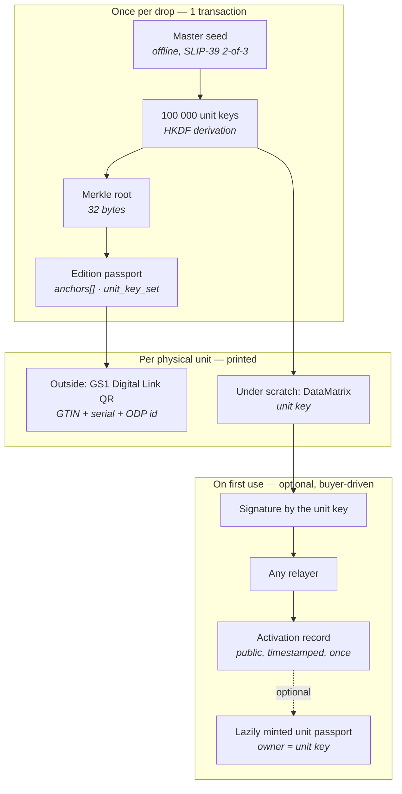

# Edition passports and unit activation keys

*Design note for the **v0.7** line. **Non-normative** — this document records the decisions and their rationale. Binding rules land in [`SPEC.md`](../SPEC.md) once the model is settled.*

*Status: draft · Author: Andrei Chernikov · RU mirror: [`web/frontend/localization/ru/EDITION_UNIT_KEYS.md`](../web/frontend/localization/ru/EDITION_UNIT_KEYS.md)*

---

## 1. The problem this solves

The v0.6 model assumes one passport per object. That is right for a painting and wrong for a series of blind-box figures produced in tens or hundreds of thousands of identical units.

Three things break at that scale:

| | v0.6 single-object model | Mass-produced edition |
|---|---|---|
| Identification anchors | unique per object | **identical across the whole run** — same photo, same dimensions, same materials |
| Cost | one mint per object, negligible | 100 000 mints per drop, and ~90 % of them never read by anyone |
| Seal | NTAG 424 DNA TagTamper (~$0.30–0.60 per chip) | prohibitive on a $15 unit |

So the unit of registration has to change: **the passport describes the edition, and each physical unit carries a key that proves membership in it.**

This is a **B-profile** (brand) feature. It does not change anything for C / P / M profiles.

## 2. What the industry does today, and why it is not enough

The dominant mechanism for mass-produced authentication — used by Pop Mart and by essentially every security-label vendor — is a scratch-off panel hiding a serialized code, checked against the brand's own database. Date, time and location of the *first* check are logged; a second checker sees "already verified three weeks ago in another country".

The mechanism is sound. Its foundations are not:

1. **The brand is the judge.** "Genuine" means only "the brand's server said so today". The server can be switched off, the company sold, the database rewritten.
2. **Database dumps leak.** Pop Mart warns publicly that counterfeiters clone codes taken from stolen database entries. An insider at the brand or the print vendor sees every code before a single box ships.
3. **The first-check log is private.** The buyer cannot verify it — only trust the screen.
4. **"No record" proves nothing**, and "record found" proves nothing either.

ODP's contribution is not another scratch code. It is **moving the judge out of the brand**: the code is bound to the passport by a hash, the first use is a public timestamped event, and verification keeps working when the brand does not.

## 3. Model overview



### 3.1 The edition passport

One ordinary ODP passport per edition, minted by a B profile, carrying the usual v0.6 identification minimum — the anchors describe the *edition*, not any single unit.

It gains one new anchor type:

**`unit_key_set`**

| Field | Required | Meaning |
|---|---|---|
| `merkleRoot` | yes | Root over all unit leaves |
| `unitCount` | yes | Number of units in the run |
| `leafFormat` | yes | How a leaf is built (see below) |
| `hashAlg` | yes | `sha256` in the first version |
| `shippingDate` | recommended | Declared first-shipment date — see §8.3 |

**Leaf format:** `leaf_i = SHA-256( uint32be(i) ‖ unitAddress_i )`

The unit index is inside the leaf on purpose: it welds serial numbers to addresses before printing, so a code from box #7 cannot later be presented as box #48 231.

The full list of unit addresses is published as an ordinary public file next to the `.odpass` bundle (~2 MB for 100 000 units, nothing secret in it). Anyone can rebuild the tree and any Merkle proof from it, so the printed carrier does not have to hold the proof.

**Cost:** 100 000 units add **32 bytes** to the chain. One mint, ~$0.02.

### 3.2 Blind-box variant commitment (optional)

For blind-box products, the packer knows which SKU went into which box. Publishing that would destroy the product; publishing a *commitment* to it does not:

**`unit_variant_commit`** — a second Merkle root over `SHA-256( uint32be(i) ‖ variant_i ‖ salt_i )`.

After opening, the buyer receives `salt_i`, and the chain confirms that box #48 231 was officially recorded as containing the chase variant. On a secondary market where chase figures resell at 10–50× and rarity claims rest on the seller's word, this is the feature brands will actually pay for — **provable rarity**, not abstract anti-counterfeiting.

### 3.3 Unit keys

Keys are **derived, not stored**:

```
masterSeed        = 256 random bits, generated offline
unitSeed_i        = HKDF-SHA256(masterSeed, info = editionContext ‖ uint32be(i))
unitKey_i         = secp256k1 private key from unitSeed_i
unitAddress_i     = corresponding address
```

`editionContext` binds the derivation to one edition so that seeds never collide across drops.

Consequence: the brand stores **one seed**, not a hundred thousand secrets.

### 3.4 The printed code

| Property | Decision |
|---|---|
| Primary carrier | **DataMatrix under the scratch layer** — scratch, point camera, done |
| Fallback | 25 characters of text for damaged or smudged symbols |
| Text format | 20 payload characters (~100 bit) + 5 check characters, Crockford Base32 (no `O/0`, `I/1`, `L`) |
| Entropy floor | **≥ 80 bit — hard requirement** |

The entropy floor is a direct consequence of decentralization and is easy to get wrong. In a server-based system an 8-character code is safe because the server rate-limits guessing. **ODP has no server.** The address list is public and verification runs offline, so an attacker can grind candidate codes locally at millions per second with nobody watching. Short codes are not an option here, and this cannot be fixed after the labels are printed.

### 3.5 The label

**Outside, open** — a **GS1 Digital Link** QR carrying the brand's GTIN and the unit serial, with the ODP identifiers attached as additional link parameters.

One symbol serves three readers: retail scanners see a familiar GTIN, the ODP verifier sees its passport ID and unit index, and an EU DPP resolver sees what it expects. The alternative — a proprietary ODP-only QR — forces the brand to choose between ODP and the compliance carrier it will need anyway under ESPR (batteries from February 2027, textiles and furniture 2027–2028, electronics through 2030). It will choose compliance.

**Under the scratch layer** — the DataMatrix from §3.4.

**Physical requirement:** the label must be applied across the package seam so that removing it is visibly destructive. This is the *only* physical binding in the whole scheme; everything cryptographic sits on top of it.

## 4. Key ceremony

Generation happens on an offline machine using a reference CLI shipped with the protocol. The master seed is split with **SLIP-39** (Shamir) in a **2-of-3** configuration:

| Share | Holder |
|---|---|
| 1 | Brand security officer |
| 2 | A different department — legal or finance, separate safe |
| 3 | Notarial or bank escrow |

Any two shares reconstruct the seed; **one share yields nothing** — not a halved search space, no information at all. No individual can regenerate the codes; losing one safe does not lose the run; reprinting requires two people and leaves a trail.

The corporate-security vocabulary for this is **split knowledge** and **dual control** (NIST SP 800-57 Part 2; PCI PIN Security requirements). Brands' security teams already operate under these terms — this does not need explaining from scratch.

**Printing** must happen at a facility with security-print management, i.e. **ISO 14298**. See §8.2 for why this is an organizational control and not a cryptographic one.

**Optional attestation of the ceremony.** No new mechanism is needed: a witness holding a **P profile** publishes an ordinary `submitProof` against the edition passport on `ODPPassportProofRegistry` — "the key ceremony for edition X was performed under the ODP profile, shares split, seed never left the offline machine, on date Y". The edition then reaches the existing **Attested** tier, which now also carries meaning about the *process*, not only the object. Zero new core code.

### 4.1 What ODP itself must never do

**ODP cannot hold a share, a seed, or a key — for any edition, ever.**

The project's core promise is that passports outlive the project ("what happens if the project's site disappears? The passports survive it"). The moment ODP custodies fragments of third-party production secrets, it acquires servers that cannot be switched off, liability, insurance and a legal entity — exactly the centralization the protocol exists to avoid.

ODP's role here is **to be text, not a participant**:

1. **Normative format** in `SPEC.md` — derivation, Merkle construction, code encoding, the `unit_key_set` anchor. Required, or third-party verifiers cannot check anything.
2. **A ceremony profile** — a recommendation-level document in the genre of [`ISSUER_NFC_FLOW.md`](ISSUER_NFC_FLOW.md): who is present, what is destroyed, what is signed off.
3. **A reference offline CLI** under MIT, run by the brand on its own air-gapped machine. ODP stores nothing.

## 5. Activation

Activation is a **signature**, not a service call.

```
message = domain separator
        ‖ chainId ‖ contract address
        ‖ edition passport id
        ‖ unit index
        ‖ action = "activate"
signed by unitKey_i
```

Rules:

- **The on-chain function is permissionless.** It authenticates the *signature*, not `msg.sender`. Whoever submits the transaction is a courier and gets no rights from it.
- **Anyone may publish**: the brand's server, a marketplace, a collector's club, any ODP-aware application minting from its own wallet, or the buyer's own wallet as the last-resort path.
- **A signature can be held and published later** — offline for a year, from someone else's phone, after the brand is gone.
- **Recorded once.** The first valid activation is written with its block timestamp; later submissions are no-ops returning the existing record.
- **Gasless for the buyer.** No wallet, no tokens, no account.

Because the message is fully specified by the spec, no agreement with anyone — brand or ODP — is required to become an activation point. This is what keeps the promise "the passports survive us" true for this feature and not only for the registry.

## 6. Ownership: the bearer model

On activation, a **unit passport may be lazily minted** — created only when someone actually needs it, rather than 100 000 times in advance. It is parented to the edition passport, with membership proven by a Merkle proof, and from there lives by ordinary ODP rules: owner-supplied photo anchors, append-only events, transfers, attestations.

**Owner starts as the unit key address.** The code behaves like a bearer instrument: whoever holds the paper holds the passport — which is exactly the physics of a code sitting inside a box that travels with the object. Lose the box, lose the passport.

**Later, one tap moves it to a real wallet**: the holder signs a transfer with the same unit key. No barrier at the entrance; a real custodial guarantee for whoever wants one.

Who pays for the lazy mint is a commercial decision, not a protocol one. The workable default: the brand covers it during the first year after the drop as a marketing cost, after which the owner does.

## 7. When the code was already activated

The verifier **states the fact and the timestamp, and stops there.** No verdict, no accusation, no complaint button.

This follows the position v0.6 already takes on duplicate passports: the protocol does not decide which of two competing records is "the real one"; it surfaces the signals and leaves the judgement to people. A conflict has two innocent readings — a cloned code, or a legitimately second-hand item — and the protocol can distinguish neither.

`ODPCounterfeitConcern` remains available as a separate, general-purpose mechanism. It is deliberately **not** wired into this flow.

## 8. Honest limits

None of the following is fixed by this design, and none should be implied in product copy.

### 8.1 The brand knows every key at generation time

It can silently activate codes itself. Unless the seed is destroyed after printing — which no outsider can verify — this is unavoidable. The industry has the same hole; ODP's only advantage is that it says so out loud.

### 8.2 The print vendor sees the codes

To print a code you must know it. No cryptography avoids this. The control is physical — a certified facility, waste accounting, destruction of spoilage — which is why §4 names ISO 14298 rather than a cleverer key scheme. **Splitting the seed does not address this threat**; it addresses only later regeneration from stored material (§4).

### 8.3 The brand could pre-activate before shipping

Not preventable, but **observable**: the edition passport declares `shippingDate`, and every activation carries a public block timestamp. A cluster of activations before the declared ship date is a red flag visible to everyone. Pop Mart's equivalent log is private and this check is impossible there.

### 8.4 A conflict is visible but not adjudicated

If a counterfeiter clones a real box including its code, and their buyer activates first, the genuine owner sees "already activated". The chain shows the conflict; it does not say who is right. Still strictly better than "no record → probably fake", but not a verdict.

### 8.5 A sealed fake is indistinguishable before scratching

Until the layer is removed there is nothing to check but the outer QR. This is why the outer QR must report activation state — it is the only pre-purchase signal that exists.

### 8.6 The key binds the package, not the object inside

At edition level the code identifies a **box**. What is inside becomes bound only through §3.2 (variant commitment) and §6 (a lazily minted unit passport carrying the owner's own photo anchors).

## 9. Standards touchpoints

| Standard | Where it applies |
|---|---|
| **GS1 Digital Link** | Outer QR payload; the identifier pattern recognised under EU ESPR for Digital Product Passports |
| **ISO/IEC 20248** ("DigSig") | Compact digitally-signed data in a barcode, designed for **offline** verification — the barcode-industry framing of exactly this scenario |
| **ISO/IEC 16022** | DataMatrix symbology under the scratch layer |
| **SLIP-39** | Shamir splitting of the master seed |
| **NIST SP 800-57 Part 2**, **PCI PIN Security** | Vocabulary and requirements for split knowledge / dual control |
| **ISO 14298** | Security printing process management |

A naming note worth deciding early: this project is **Object** Digital Passport while the EU regulation creates the **Product** Digital Passport. That collision is both a risk of confusion and an open door — a single GS1-conformant carrier that serves both is the reason a brand does not have to choose between ODP and its compliance obligations.

## 10. Decisions on record

| # | Question | Decision |
|---|---|---|
| 1 | What does the secret prove? | Both one-time first use **and** repeatable possession — via a keypair, not a hash commitment. The secret never appears on-chain, so it cannot be front-run |
| 2 | Passport granularity | One passport per **edition** + Merkle root of unit keys; per-unit passports **lazily minted** on demand |
| 3 | Does the code identify a box or an object? | Both layers: box for everyone, object for those who lazily mint a unit passport |
| 4 | Outer QR format | GS1 Digital Link **and** ODP identifiers in one symbol |
| 5 | Who may publish activations? | Anyone — the contract checks the signature, not the sender |
| 6 | Who owns a lazily minted unit passport? | The unit key (bearer), transferable to a real wallet later by signing with that key |
| 7 | Behaviour on an already-activated code | Show the fact and the date. No verdict |
| 8 | Master seed custody | SLIP-39 2-of-3, split knowledge + dual control. **ODP never holds a share** |
| 9 | Code entropy | ≥ 80 bit, because offline verification means no rate limiting exists |

## 11. Open questions

1. **Contract home.** A new satellite (`ODPEditionUnits`) reading the main registry, versus core changes. The satellite pattern and the EIP-170 budget both argue for a satellite — see [`EIP170_STRATEGY.md`](EIP170_STRATEGY.md).
2. **Anchor bitmask bits** for `unit_key_set` and `unit_variant_commit` in `anchorTypesMask`.
3. **Salt distribution** for the variant commitment: who hands `salt_i` to the buyer, and what happens when the brand is gone.
4. **Brands without a GTIN.** The GS1 path assumes one; small brands may not have one.
5. **Relayer economics** — spam and griefing on a permissionless, gasless activation endpoint.
6. **Revocation of an edition** — recall, print defect, compromised code batch.
7. **Localization** of the printed code alphabet and check characters.
