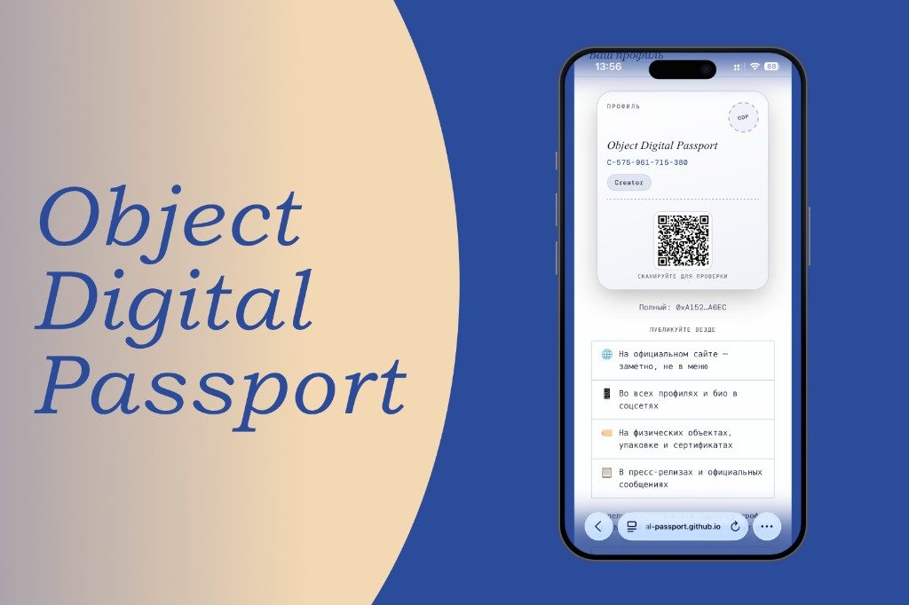

# Object Digital Passport · v0.4

[](LICENSE)
[](https://github.com/object-digital-passport/object-digital-passport/stargazers)

## Что такое ODP

**Object Digital Passport (ODP)** — **открытый стандарт подлинности объектов**. Речь может идти о **чём угодно** — о вещах, цифровых работах, коллекционных предметах и т.д.: стандарт не привязан к одной отрасли.

**Его основа — блокчейн.** И нет: это не «ещё одни NFT» и не мем-коин. В двух словах, **блокчейн** — это цепочка **блоков информации**, связанных так, что целостность цепи проверяется сетью; запись, однажды попавшая в публичный реестр, **нельзя стереть задним числом** так, будто её не было — на этом и стоит идея проверяемой подлинности. Реестр при этом **не привязан** к одной компании, подписке или частному «владельцу» индекса.

**На кого рассчитан стандарт.** ODP подходит и **одиночным авторам и мастерам**, и **организациям**: брендам, галереям, музеям, экспертным и кураторским институтам. Для институтов предусмотрены **подтверждения подлинности** (proofs), **аффилиация** «родитель — дочерние» учреждения и разные **типы профиля** в реестре (буквы **C / B / P / M** — см. [быстрый старт](#быстрый-старт-5-минут)). Нормативно всё это разложено в **[SPEC](SPEC.md)**.

## Языки и переводы


|                  |                                                     |
| ---------------- | --------------------------------------------------- |
| 🇬🇧 **English** | Основной README: [../../README.md](../../README.md) |
| 🇷🇺 **Русский** | Вы читаете русскую версию (этот файл).              |


**Мы рады переводам README и интерфейса на любой язык.** Добавьте файлы в `localization/<код-языка>/` (ориентир — структура [../ru/](../ru/)). Откройте **Pull Request** или **Issue** — разберём предложение. Оформление правок: **[CONTRIBUTING.md](CONTRIBUTING.md)** (оригинал EN: [../../CONTRIBUTING.md](../../CONTRIBUTING.md)).

**Помогите проекту:** переводите, делитесь **[ссылкой на репозиторий](https://github.com/object-digital-passport/object-digital-passport)**, расскажите тем, кому может быть важна открытая проверяемость происхождения объектов.

---

## Позиционирование

ODP **не заменяет** экспертизу человека, работу по происхождению в институтах и другие стандарты. Он рассчитан на **дополнение** — например программам **цифрового паспорта продукта (DPP)**, данным **GS1**, доставке медиа **IIIF** и учётным данным **C2PA** (см. [SPEC.md](SPEC.md) §18). Идея **проверяемого реестра**: при проверке видно, какой деплой и какие правила зафиксировали запись, плюс целостность файла.

**Спам и злоупотребления:** запись в общий индекс через сеть частично задумана как способ уменьшить шум, но оптимальный баланс для стабильного продукта ещё предстоит найти.

**Интерфейсы:** спецификация **не задаёт** обязательный визуальный дизайн приложений; к стабильной версии это можно обсудить с сообществом.

## Как работает ODP

**В двух словах:** вы один раз оформляете **роль выпускающего** в общем реестре (профиль), потом для каждого объекта создаёте **паспорт**. В блокчейн попадает не «простыня текста», а **отпечаток** вашего файла плюс при желании **ссылка** на ZIP **§15 `.odpass`** в интернете (**не** «голый» JSON по этому адресу). Проверяющему достаточно открыть [страницу проверки](https://object-digital-passport.github.io/object-digital-passport/verify.html): он сверит файл с записью в сети — **кошелёк не нужен**.

**Четыре шага по порядку**

1. **Профиль.** Вы регистрируете себя (или организацию) и получаете постоянный **ID профиля** — с буквой в начале (**C / B / P / M**), чтобы было понятно, кто вы в системе.
2. **Паспорт объекта.** Вы описываете вещь в форме и подтверждаете запись в сети. В реестре сохраняются **хэши**, опционально **публичный URL** файла и служебные поля по правилам **[SPEC](SPEC.md)** — так фиксируется «какой паспорт к какому реестру относится» (в проекте используются развёртывания вроде **v0.4** / **v0.3**).
3. **Чем делиться с миром.** Обычно передают **номер паспорта** `ODP-…` и при необходимости файл `**.odpass`**, сырой `passport.json` офлайн или публичный HTTPS-URL, где лежит ZIP §15 `.odpass` (не «голый» JSON по этому адресу) — чтобы любой мог получить байты и сверить их с тем, что записано как `**dataHash`**.
4. **Проверка.** Любой человек (или сервис) берёт **ваш файл или ссылку**, смотрит **публичные данные** в блокчейне и убеждается: содержимое **не подделано** и соответствует записи. Это чтение «снаружи», без права что-либо менять в реестре.

**Публичность профиля — обязательна.** Участники (**C / B / P / M**) **должны** публично выкладывать **короткий ID профиля** вместе с **полным адресом кошелька** (0x…). Это **требование протокола**, не рекомендация: иначе в сети остаётся анонимная запись, и **нельзя отличить** осмысленную публикацию от **спама** или подмены. Когда тот же **короткий ID** и **кошелёк** видны на вашем официальном сайте и в других каналах, проверяющий понимает: запись сделана **реальным** автором или организацией, а не случайным адресом. Нормативно и с примерами — в **[SPEC](SPEC.md)** (раздел о публичной идентичности).

**Где публиковать (как заложено в спецификации и на страницах проекта):**

- на **официальном сайте** — заметно, не спрятано в глубоком меню;
- в **публичных профилях** соцсетей и биографиях;
- на **упаковке, сертификатах**, маркировке — где это уместно;
- в любых **других публичных каналах**, которыми вы управляете и где пользователь ожидает контекст для проверки.

**Оба формата** (короткий ID и полный адрес) должны **легко находиться**. Название бренда или института в контракт **не записывается** — поэтому доверие строится на том, что вы **сами** опубликовали свой ID рядом с брендом. Пример блока для страницы (как в SPEC / разметке справки):

```text
Создатель на example.com:
  Короткий:  C-482-930-174-005
  Полный:    0x742d35Cc…4438f44e

Музей на museum.com:
  Короткий:  M-204-839-112-441
  Полный:    0xB3F924ee…1823A3c8A
```

**Если вы смотрите в JSON или код**

- У человека номер паспорта выглядит как **Passport ID** (`ODP-YYYY-MM-…`).
- В файле `**passport.json`** то же значение лежит в поле `**passportId`**.
- В низкоуровневых вызовах контракта то же поле исторически может называться `**humanId`** — смысл тот же.

---

## README и протокол

В этом README — в первую очередь **практическая дорожка**, как **быстро проверить** технологию на **нашем [демо-сайте](#демонстрация)**. Сам ODP — это **спецификация**, которую можно **интегрировать как угодно и куда угодно** (свои сайты, приложения, бэкенды, партнёрские сценарии); для интеграции опирайтесь на **[SPEC](SPEC.md)**.

Глубоко разбираться в устройстве блокчейна **не обязательно**, чтобы попробовать **[демо-сайт](#демонстрация)**. Проверка паспорта бесплатна и не требует кошелька. Выпуск профиля и паспорта использует обычные браузерные кошельки и небольшую комиссию сети Polygon (часто порядка **~1 ₽** на типичную операцию — зависит от загрузки сети) — подробности в [С чего начать](#с-чего-начать) и [Быстрый старт](#быстрый-старт-5-минут).

**Что это за страница?** [GitHub](https://github.com/) — место, где лежат **открытый** код, спецификация и инструменты. Всё можно читать бесплатно, копировать проект или предложить правки — для чтения аккаунт не нужен.

## Оглавление

**С чего начать**

- [Что такое ODP](#что-такое-odp)
- [Языки и переводы](#языки-и-переводы)
- [Позиционирование](#позиционирование)
- [Как работает ODP](#как-работает-odp)
- [README и протокол](#readme-и-протокол)
- [С чего начать](#с-чего-начать)
- [Быстрый старт (5 минут)](#быстрый-старт-5-минут)
- [Демонстрация](#демонстрация)

**Техническая справка**

- [Стек v0.4 (кратко)](#стек-v04-кратко)
- [Текущий релиз](#текущий-релиз)
- [Коротко о терминах](#коротко-о-терминах)
- [Безопасность и модель проверки](#безопасность-и-модель-проверки)
- [Сеть и стоимость](#сеть-и-стоимость)
- [Дорожная карта](#дорожная-карта)
- [Как вносить вклад](#как-вносить-вклад)
- [Автор и лицензия](#автор-и-лицензия)

## С чего начать

Если вы только знакомитесь с ODP, удобно идти по шагам:

1. **Кошелёк.** Чтобы что-то записать в сеть, нужен криптокошелёк — расширение в браузере или приложение. Для тестов заведите **отдельный** кошелёк, не тот, где лежат основные деньги. Запишите резервную фразу и храните её офлайн. Если сайт просит «подключить кошелёк», не спешите — это нормально для таких страниц, но мошенники тоже так делают; читайте справку **вашего** кошелька, например у [MetaMask](https://support.metamask.io/) или [Rabby](https://rabby.io/) (конкретная программа не принципиальна). На **[профиле](https://object-digital-passport.github.io/object-digital-passport/creator.html)** и **[паспорте](https://object-digital-passport.github.io/object-digital-passport/passport.html)** можно подписывать действия и с телефона по QR. За запись в сети платится небольшая **комиссия сети** (в сети Polygon это обычно **POL**); отдельного сбора «за ODP» нет — см. [Сеть и стоимость](#сеть-и-стоимость). Если вы **сами размещаете** копию сайта у себя, для части функций нужны настройки — см. `[../../web/odp-wc-config.js](../../web/odp-wc-config.js)` и [заметки к релизу](../../RELEASE_v0.4.md).
2. **Этот текст.** Дочитайте README до конца — здесь обзор «как пользоваться», без обязательного чтения кода.
3. **Правила по букве.** Точные правила протокола на английском: **[SPEC (EN)](../../SPEC.md)**. Справочный перевод: **[SPEC](SPEC.md)**.
4. **Если копаете глубже.** Что нового в текущей линии: **[RELEASE v0.4 (EN)](../../RELEASE_v0.4.md)**. Сравнение с более ранними версиями: **[RELEASE v0.3 (EN)](../../RELEASE_v0.3.md)** · **[RELEASE v0.3 (RU)](RELEASE_v0.3.md)**. Как **развернуть свой** реестр в сети (для разработчиков): **[deploy/README](../../deploy/README.md)**.

**Пока это тестовая линия.** Сейчас ODP в фазе **разработки, проверок и сбора отзывов** — правила и развёртывания могут меняться. Мы нацелены на **стабильный релиз линии 1.x** примерно к **январю 2027**: там закрепим правила «на долгий срок». Если вам нужна **действительно долгосрочная** запись и вы не хотите рисковать сменой правил, **лучше дождаться стабильного релиза**. У каждого адреса контракта в сети — **свой** реестр; между разными установками записи **сами не переносятся**. Подробнее о версиях: **[VERSIONING_AND_RELEASES](../../docs/VERSIONING_AND_RELEASES.md)**.

## Быстрый старт (5 минут)

### 1) Кошелёк и комиссия сети

- Подойдёт кошелёк в браузере (**MetaMask**, **Rabby**, Coinbase Wallet, Brave и др.) **или** с телефона: в меню на страницах профиля и паспорта используется **[WalletConnect](https://docs.reown.com/)** (QR или ссылка в приложение). Подойдут, например, **Tangem**, MetaMask на телефоне, Rainbow и другие кошельки с поддержкой WalletConnect.
- Держите небольшой баланс **POL** — валюта сети Polygon, ею оплачивается комиссия за запись.
- **Лучше отдельный кошелёк только под ODP**, не для долгосрочных сбережений и спекуляций (так меньше риск, если сайт окажется вредоносным).

### 2) Регистрация профиля

- Откройте [страницу профиля](https://object-digital-passport.github.io/object-digital-passport/creator.html).
- Один раз зарегистрируйтесь и получите **идентификатор профиля** — строку вида `C-…`, `B-…`, `P-…` или `M-…` (буква задаётся при регистрации и дальше не меняется «само собой»).

**Что означает буква в начале ID**


| Префикс                   | Кому обычно подходит                           | Коротко                                                                                                                         |
| ------------------------- | ---------------------------------------------- | ------------------------------------------------------------------------------------------------------------------------------- |
| **C** (Creator)           | Индивидуальный автор, мастер, небольшая студия | Выпуск от своего имени без «организационной» оболочки                                                                           |
| **B** (Brand)             | Бренд, компания, юрлицо                        | Выпуск объектов от имени организации                                                                                            |
| **P** (Proof institution) | Экспертное / кураторское учреждение            | Может выдавать **подтверждения** (proofs) другим; поддерживается **аффилиация** с дочерними организациями                       |
| **M** (Museum)            | Музей, коллекция                               | Кураторские и музейные сценарии; вместе с **P** участвуют в расширенных проверках (в т.ч. concern в v0.4 — см. [SPEC](SPEC.md)) |


Подробные правила лимитов, proofs и аффилиации — в **[SPEC](SPEC.md)** (нормативный текст на английском).

### 3) Паспорт: создать, подтвердить, сохранить файл

Коротко: вы заполняете форму, один раз подтверждаете запись в сети кошельком и **обязательно скачиваете** готовый пакет — без него «полной» проверки не будет.

1. Откройте [страницу «Паспорт»](https://object-digital-passport.github.io/object-digital-passport/passport.html) и заполните поля.
2. Подтвердите транзакцию в кошельке — так паспорт **записывается в блокчейн** (спишется небольшая комиссия сети, не отдельный сбор «за ODP»).
3. **Скачайте** файл `**.odpass`** на экране успеха и **положите его в надёжное место**. Демо-сайт **не хранит** вашу выгрузку: ушли со страницы без сохранения — получить тот же пакет «с сервера» уже нельзя.

**Что вы скачали.** Это ZIP-архив по §15 спецификации с именем на `**.odpass`**: внутри главный `**passport.json`** (именно он хэшируется и попадает в сеть как `**dataHash**`), служебный `**manifest.json**` и папка `**originals/**` с вложениями — точный состав по **[SPEC](SPEC.md)**.

**Почему файл нельзя терять.** В реестре лежит **отпечаток** данных, а не «красивый паспорт целиком». Чтобы кто угодно увидел текст, картинки и вложения и сверил их с сетью, нужны **те же байты**, что и при выпуске: ваш `**.odpass`** или **сырой `passport.json`** офлайн. Для **автоподгрузки по сети** публичный `**dataUrl`** **должен** отдавать ZIP **§15 `.odpass`** — **не** «голый» JSON по этому адресу (см. пункт 4 и **SPEC §9**). Если остаётся только номер `ODP-…` без файла — на странице проверки будет **мало смысла**: в основном идентификаторы и хэши.

**Публичная ссылка — сразу или потом.** В форме можно указать HTTPS-адрес файла (**папка на вашем сайте**, **полный URL** или **оставить пустым**). Не определились — не страшно: `**dataUrl`** можно **добавить или поменять** позже отдельной транзакцией («Обновить URL хостинга» на странице паспорта).

### 4) Выложить тот же файл по ссылке (по желанию, но так проще другим)

Нужно, если вы хотите, чтобы **любой человек** мог открыть [проверку](https://object-digital-passport.github.io/object-digital-passport/verify.html), ввести `ODP-…` и **автоматически подтянуть** паспорт из интернета — без пересылки `.odpass` вручную.

- По зарегистрированному `**dataUrl`** **должен** отдаваться **ZIP §15 `.odpass`**, из которого извлечённый `passport.json` совпадает с `**dataHash`** — [Verify](https://object-digital-passport.github.io/object-digital-passport/verify.html) скачивает этот ZIP и **не** считает допустимым хостинг «голого» `.json` по URL.
- Ссылка должна быть **по HTTPS** и вести **на файл**, а не на страницу входа, HTML-обёртку или «просмотр» в облаке без прямой выдачи байтов.
- После того как URL записан в реестр, **не подменяйте** файл на хостинге другим содержимым — хэш перестанет совпадать с `**dataHash`**, и проверка покажет несоответствие.

### 5) Проверка

- Откройте [Verify](https://object-digital-passport.github.io/object-digital-passport/verify.html).
- Введите Passport ID, вставьте ссылку `odp://...` или перетащите файл `**.odpass`**.

## Демонстрация

Базовый URL:

- [https://object-digital-passport.github.io/object-digital-passport/](https://object-digital-passport.github.io/object-digital-passport/)

Страницы:

- Verify (без кошелька): [verify.html](https://object-digital-passport.github.io/object-digital-passport/verify.html)
- Профиль (нужен кошелёк и комиссия сети): [creator.html](https://object-digital-passport.github.io/object-digital-passport/creator.html)
- Паспорт (нужен кошелёк и комиссия сети): [passport.html](https://object-digital-passport.github.io/object-digital-passport/passport.html)

## Стек v0.4 (кратко)

**Репозиторий** (ветка `main`) — эталонная линия **v0.4**: on-chain поколение **4** при деплое Solidity из этого дерева (упакованный байт `CONTRACT_VERSION` = **4**), спутники `ODPWalletDocumentAnchor` / `ODPCounterfeitConcern`, WalletConnect на статических страницах и урезанное публичное ABI основного реестра — см. [RELEASE v0.4](../../RELEASE_v0.4.md) и справочный [SPEC](SPEC.md); нормативный текст на английском — [SPEC.md](../../SPEC.md). **Адреса Polygon по умолчанию** в корневом README и в [deploy/deployments/polygon.json](../../deploy/deployments/polygon.json) соответствуют деплою **поколения 4**, зашитому в `NET.*` статических страниц; при своём хостинге сверяйте **сеть + адрес + ABI** с вашим развёртыванием.


|                                   |                                                                                                                                                                                               |
| --------------------------------- | --------------------------------------------------------------------------------------------------------------------------------------------------------------------------------------------- |
| **Исходники**                     | Ветка `main` в этом репозитории — эталонный стек **v0.4** (контракты + статический веб).                                                                                                      |
| **Поколение на цепочке**          | `CONTRACT_VERSION` = **4** (та же форма tuple `Passport`, что у поколения **3**).                                                                                                             |
| **Новое относительно линии v0.3** | Опциональный спутник `ODPCounterfeitConcern` (P/M); из основного байткода убраны публичные геттеры `SPEC_*` / `MONTHLY_LIMIT_*` ради **EIP-170** — см. [RELEASE v0.4](../../RELEASE_v0.4.md). |
| **Порядок деплоя**                | `ODPPassportLib` → `ObjectDigitalPassport` → при необходимости `ODPWalletDocumentAnchor` / `ODPCounterfeitConcern` — [deploy/README.md](../../deploy/README.md).                              |


## Текущий релиз

Эталонный деплой (**основная сеть Polygon**, `chainId` 137), на который по умолчанию нацелен статический UI этого репозитория:


| Пункт                                                                   | Значение                                                                                                                   |
| ----------------------------------------------------------------------- | -------------------------------------------------------------------------------------------------------------------------- |
| Линия протокола                                                         | **v0.4** — on-chain поколение **4** (байт `CONTRACT_VERSION` = **4**; та же форма tuple `Passport`, что у поколения **3**) |
| Основной реестр `ObjectDigitalPassport`                                 | `[0x35c29A1faC6e39925BeF616bb5222F024E5D6132](https://polygonscan.com/address/0x35c29A1faC6e39925BeF616bb5222F024E5D6132)` |
| Связанная библиотека `ODPPassportLib` (верификация / линковка байткода) | `[0x8D2f3C374CE5424E988aa8AEA93487A327f7450F](https://polygonscan.com/address/0x8D2f3C374CE5424E988aa8AEA93487A327f7450F)` |
| Спутник якорей файлов `ODPWalletDocumentAnchor`                         | `[0xcb3AF1d0530ca1D8D78528E4ED93ac7C2eb64210](https://polygonscan.com/address/0xcb3AF1d0530ca1D8D78528E4ED93ac7C2eb64210)` |
| Спутник `ODPCounterfeitConcern`                                         | `[0x7C2EAaC6b0E4c14765d4064885A175fD057f680e](https://polygonscan.com/address/0x7C2EAaC6b0E4c14765d4064885A175fD057f680e)` |


**Заметки к релизу:** `[RELEASE_v0.4.md](RELEASE_v0.4.md)` · `[../../RELEASE_v0.4.md](../../RELEASE_v0.4.md)` · **ранее (v0.3 vs v0.2):** `[RELEASE_v0.3.md](RELEASE_v0.3.md)` · `[../../RELEASE_v0.3.md](../../RELEASE_v0.3.md)`.

## Коротко о терминах


| Термин          | Что значит в ODP                                                                           |
| --------------- | ------------------------------------------------------------------------------------------ |
| Register        | Одноразовая регистрация профиля (`registerCreator`)                                        |
| Выпуск / mint   | Создание новой паспортной записи в сети (в интерфейсе — «выпуск»; в ABI может быть *mint*) |
| Passport ID     | Человекочитаемый идентификатор объекта (`ODP-...`)                                         |
| ID профиля      | Идентификатор выпускающей стороны (`C/B/P/M-...`)                                          |
| `passport.json` | Канонический off-chain документ объекта                                                    |
| `dataUrl`       | Необязательный HTTPS-адрес для JSON или архива `**.odpass`**                               |
| Verify          | Проверка только для чтения (без кошелька и без сбора протокола)                            |


## Безопасность и модель проверки

Модель угроз и границы доверия:

- **[`SECURITY.md`](../SECURITY.md)** (RU) · **[`../../SECURITY.md`](../../SECURITY.md)** (EN)

Основа проверки:

- хэши в сети задают, что было зарегистрировано;
- `**passport.json`** (или байты внутри `**.odpass`**) должны совпадать с сохранённым `**dataHash`** (и связанными полями по спецификации);
- `**manifest.json**` в `**.odpass**` — метаданные упаковки для инструментов, отдельным корнем доверия не является.

Нормативные правила (EN):

- `[../../SPEC.md](../../SPEC.md)`

Деплой (EIP-170, библиотека и спутник):

- `[../../docs/PROTOCOL_TRACKS.md](../../docs/PROTOCOL_TRACKS.md)`
- `[../../docs/EIP170_STRATEGY.md](../../docs/EIP170_STRATEGY.md)`

## Сеть и стоимость

**Сеть**

- Polygon PoS (`chainId` 137)
- Тестовая сеть: Amoy (`chainId` 80002)

**Деньги**

- **Сбора протокола нет** — платится только **комиссия сети** (на Polygon типичные операции обычно недороги).
- Чтение цепочки и работа **Verify** для вас бесплатны, кроме вашего интернета.

Точные суммы комиссий плавают вместе с загрузкой сети; наценки ODP нет.

## Дорожная карта

- **0.x:** ожидаются итерации; собираем отзывы о стандарте и инструментах.
- **Цель по стабильности:** ориентир — **стабильный релиз уровня v1 к январю 2027** на основе ревью сообществом (протокол, безопасность, интерфейсы, локализация).

Подробности:

- `[../../docs/VERSIONING_AND_RELEASES.md](../../docs/VERSIONING_AND_RELEASES.md)`
- `[../../docs/V0.3.md](../../docs/V0.3.md)`
- `[../../docs/V0.4.md](../../docs/V0.4.md)` · `[RELEASE_v0.4.md](RELEASE_v0.4.md)` · `[../../RELEASE_v0.4.md](../../RELEASE_v0.4.md)` (on-chain v0.4 + сайт; эталонные адреса Polygon — `[../../deploy/deployments/polygon.json](../../deploy/deployments/polygon.json)`)

## Как вносить вклад

- Гайд: `[CONTRIBUTING.md](CONTRIBUTING.md)` (оригинал EN: `[../../CONTRIBUTING.md](../../CONTRIBUTING.md)`)
- Кодекс: `[CODE_OF_CONDUCT.md](CODE_OF_CONDUCT.md)` (EN: `[../../CODE_OF_CONDUCT.md](../../CODE_OF_CONDUCT.md)`)
- Индекс документации: `[docs/README.md](docs/README.md)` (EN: `[../../docs/README.md](../../docs/README.md)`)
- Релиз v0.3 (**отличия от v0.2**): `[RELEASE_v0.3.md](RELEASE_v0.3.md)` · `[../../RELEASE_v0.3.md](../../RELEASE_v0.3.md)`; релиз **v0.4**: `[RELEASE_v0.4.md](RELEASE_v0.4.md)` · `[../../RELEASE_v0.4.md](../../RELEASE_v0.4.md)`; версии и теги: `[../../docs/VERSIONING_AND_RELEASES.md](../../docs/VERSIONING_AND_RELEASES.md)`

Нужны участники **широкого профиля**: ревью протокола и кода, дизайн и редактура, **переводы**, доступность, документация. Цель — не узкий «только код», а совместный вывод стандарта к **стабильной линии к январю 2027**.

## Автор и лицензия

Автор:

- Andrei Chernikov

Лицензия:

- [MIT](../../LICENSE)

