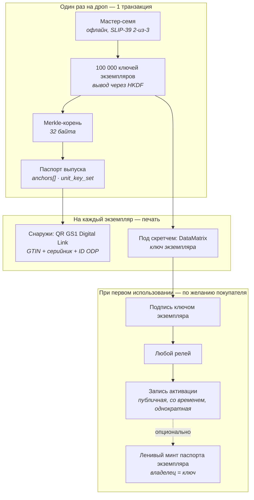

# Паспорт выпуска и ключи экземпляров

*Проектная записка для линии **v0.7**. **Ненормативная** — фиксирует принятые решения и их обоснование. Обязательные правила — **[`SPEC.md` §20](../../../../SPEC.md#20-edition-passports-and-unit-activation-keys-v07-line-b-profile-only)**; при расхождении верна спека.*

*Статус: черновик · Автор: Андрей Черников · Оригинал: [`docs/EDITION_UNIT_KEYS.md`](../../../../docs/EDITION_UNIT_KEYS.md)*

---

## 1. Какую задачу это решает

Модель v0.6 исходит из того, что паспорт — на один объект. Для картины это верно. Для серии фигурок тиражом в десятки и сотни тысяч одинаковых экземпляров — нет.

На таком масштабе ломаются три вещи:

| | Модель v0.6 (один объект) | Массовый тираж |
|---|---|---|
| Анкоры идентификации | уникальны для объекта | **одинаковы для всего тиража** — то же фото, те же размеры, те же материалы |
| Стоимость | один минт на объект, копейки | 100 000 минтов на дроп, и ~90 % из них никто никогда не прочитает |
| Пломба | NTAG 424 DNA TagTamper (~$0.30–0.60 за чип) | неподъёмно для изделия за $15 |

Значит, менять надо единицу регистрации: **паспорт описывает выпуск, а каждый физический экземпляр несёт ключ, доказывающий принадлежность к нему.**

### Только для профилей B

Это функция **профиля `B` (бренд), и запрет зашит в контракт** — это не договорённость. Кошелёк с профилем `C`, `P` или `M` не может ни заминтить паспорт выпуска, ни открыть набор ключей экземпляров (`SPEC.md` §20.1). Для этих профилей в §§6–9 ничего не меняется.

Три причины держать запрет в контракте, а не в рекомендациях:

1. Механика описывает **промышленный тираж**. Автор, регистрирующий свою работу, и музей, регистрирующий фонды, уже обслужены моделью «паспорт на объект» и здесь не получают ничего.
2. Её безопасность держится на том, что издатель способен провести контролируемую церемонию ключей (§4) и печатать на защищённом производстве. Это организационная способность, и заявляет её именно профиль `B`.
3. **Ошибочно выпущенный набор ключей нельзя отозвать поэкземплярно.** Когда 100 000 кодов напечатаны и отгружены, единственное средство — отозвать паспорт выпуска целиком. Ограничение на то, кто вообще может его создать, удерживает радиус поражения внутри профиля, за которым стоит производственный процесс.

Активация и минт паспорта экземпляра **не** ограничены: их выполняют покупатели с ключами на руках, которым не нужен ни профиль ODP, ни кошелёк.

## 2. Как это устроено в индустрии сейчас и почему этого мало

Массовый механизм проверки подлинности — им пользуется Pop Mart и практически все производители защитных этикеток — это скретч-слой, под ним серийный код, проверка по базе данных бренда. Дата, время и геолокация **первой** проверки логируются; второй проверяющий видит «код уже проверяли три недели назад в другой стране».

Механизм сам по себе разумный. Ненадёжны его основания:

1. **Судья — сам бренд.** «Подлинный» означает только «сервер бренда так сказал сегодня». Сервер можно выключить, компанию продать, базу переписать.
2. **Базы утекают.** Pop Mart прямо предупреждает, что мошенники клонируют коды из украденных записей БД. Инсайдер в компании или в типографии видит все коды до того, как отгружена первая коробка.
3. **Лог первой проверки приватный.** Покупатель не может его проверить — только поверить экрану.
4. **«Записи нет» не доказывает подделку**, и «запись найдена» не доказывает подлинность.

Вклад ODP — не ещё один скретч-код, а **вынос судьи из бренда наружу**: код привязан к паспорту хэшем, первое использование — публичное событие с меткой времени, проверка работает, когда бренда уже нет.

## 3. Модель целиком



### 3.1 Паспорт выпуска

Обычный паспорт ODP, один на выпуск, минтит профиль B, с привычным для v0.6 минимумом идентификации — анкоры описывают **выпуск**, а не отдельный экземпляр.

Добавляется один новый тип анкора:

**`unit_key_set`**

| Поле | Обяз. | Смысл |
|---|---|---|
| `merkleRoot` | да | Корень по всем листьям экземпляров |
| `unitCount` | да | Количество экземпляров в тираже |
| `leafFormat` | да | Как строится лист (см. ниже) |
| `hashAlg` | да | `sha256` в первой версии |
| `shippingDate` | рекомендуется | Заявленная дата начала отгрузки — см. §8.3 |

**Формат листа:** `leaf_i = SHA-256( uint32be(i) ‖ unitAddress_i )`

Номер экземпляра внутри листа — намеренно: он приваривает серийники к адресам ещё до печати, поэтому код от коробки №7 нельзя потом выдать за коробку №48 231.

Полный список адресов экземпляров публикуется обычным открытым файлом рядом с `.odpass` (~2 МБ на 100 000 штук, ничего секретного). Любой может пересобрать дерево и любое Merkle-доказательство из него — поэтому носителю на коробке доказательство хранить не нужно.

**Цена:** 100 000 экземпляров добавляют в блокчейн **32 байта**. Один минт, ~$0.02.

### 3.2 Обязательство о варианте для слепых коробок (опционально)

В слепой коробке упаковщик знает, какой SKU куда лёг. Опубликовать это — убить продукт; опубликовать **обязательство** — нет:

**`unit_variant_commit`** — второй Merkle-корень по `SHA-256( uint32be(i) ‖ variant_i ‖ salt_i )`.

После вскрытия покупатель получает `salt_i`, и блокчейн подтверждает: коробка №48 231 официально записана как содержащая chase-вариант. На вторичном рынке, где chase перепродаётся в 10–50 раз дороже, а заявление о редкости держится на честном слове продавца, это и есть та функция, за которую бренд действительно заплатит: **доказуемая редкость**, а не абстрактная защита от подделок.

### 3.3 Ключи экземпляров

Ключи **выводятся, а не хранятся**:

```
masterSeed        = 256 случайных бит, генерируется офлайн
unitSeed_i        = HKDF-SHA256(masterSeed, info = editionContext ‖ uint32be(i))
unitKey_i         = приватный ключ secp256k1 из unitSeed_i
unitAddress_i     = соответствующий адрес
```

`editionContext` привязывает вывод к конкретному выпуску, чтобы ключи разных дропов не пересекались.

Следствие: бренд хранит **одно семя**, а не сто тысяч секретов.

### 3.4 Печатаемый код

| Свойство | Решение |
|---|---|
| Основной носитель | **DataMatrix под скретч-слоем** — стёр, навёл камеру, готово |
| Запасной | 25 знаков текстом, на случай смазанного символа |
| Формат текста | 20 знаков полезной части (~100 бит) + 5 контрольных, Crockford Base32 (без `O/0`, `I/1`, `L`) |
| Минимум энтропии | **≥ 80 бит — жёсткое требование** |

Порог энтропии — прямое следствие децентрализации, и его легко проглядеть. В серверной системе восьмизначный код безопасен, потому что сервер ограничивает перебор. **У ODP сервера нет.** Список адресов открыт, проверка работает офлайн — значит, атакующий перебирает коды у себя на машине миллионами в секунду, и этого никто не видит. Короткие коды здесь недопустимы, и после печати этикеток исправить это уже нельзя.

### 3.5 Этикетка

**Снаружи, открыто** — QR формата **GS1 Digital Link** с GTIN бренда и серийным номером экземпляра; идентификаторы ODP прицеплены дополнительными параметрами.

Один символ обслуживает трёх читателей: сканер ритейла видит привычный GTIN, верификатор ODP — свой ID паспорта и номер экземпляра, резолвер EU DPP — то, что ожидает. Альтернатива — собственный QR только для ODP — заставляет бренд выбирать между ODP и носителем, который ему всё равно понадобится по ESPR (батареи с февраля 2027, текстиль и мебель 2027–2028, электроника до 2030). Он выберет регуляторику.

**Под скретч-слоем** — DataMatrix из §3.4.

**Физическое требование:** этикетка клеится через шов упаковки так, чтобы снять её без видимых разрушений было нельзя. Это **единственная** физическая привязка во всей схеме; вся криптография стоит сверху на ней.

## 4. Церемония генерации ключей

Генерация проходит на офлайн-машине референсным CLI из состава протокола. Мастер-семя делится по **SLIP-39** (схема Шамира) в конфигурации **2 из 3**:

| Доля | Держатель |
|---|---|
| 1 | Офицер безопасности бренда |
| 2 | Другой отдел — юридический или финансовый, отдельный сейф |
| 3 | Нотариальный или банковский депозит |

Любые две доли восстанавливают семя; **одна не даёт ничего** — не половину пространства перебора, а ноль информации. В одиночку коды не восстановит никто; потеря одного сейфа не теряет тираж; для допечатки нужны двое, и это оставляет след.

На языке корпоративной безопасности это называется **split knowledge** (никто не знает секрет целиком) и **dual control** (для операции нужны минимум двое) — термины из NIST SP 800-57 Part 2 и требований PCI PIN Security. Службы безопасности брендов уже живут по ним, объяснять с нуля не придётся.

**Печать** — только на производстве с управлением процессами защитной печати, то есть по **ISO 14298**. Почему это организационный, а не криптографический контроль — см. §8.2.

**Опциональное заверение церемонии.** Новых механизмов не нужно: свидетель с профилем **P** публикует обычный `submitProof` на паспорт выпуска в `ODPPassportProofRegistry` — «церемония генерации ключей для выпуска X проведена по профилю ODP, доли разделены, семя не покидало офлайн-машину, дата такая-то». Выпуск получает существующий уровень **Attested**, который теперь говорит и о **процессе**, а не только об объекте. Ноль нового кода в ядре.

### 4.1 Чего сам ODP делать не должен никогда

**ODP не может держать долю, семя или ключ — ни для одного выпуска, ни при каких условиях.**

Обещание проекта в том, что паспорта переживут проект («что будет, если сайт проекта исчезнет? Паспорта переживут его»). Как только ODP хранит куски чужих производственных секретов, у него появляются серверы, которые нельзя выключить, ответственность, страховка и юрлицо — ровно та централизация, ради ухода от которой всё затевалось.

Роль ODP здесь — **быть текстом, а не участником**:

1. **Нормативный формат** в `SPEC.md` — вывод ключей, построение дерева, кодирование кода, анкор `unit_key_set`. Обязательно, иначе сторонний верификатор ничего не проверит.
2. **Профиль церемонии** — документ уровня рекомендации в жанре [`ISSUER_NFC_FLOW.md`](../../../../docs/ISSUER_NFC_FLOW.md): кто присутствует, что уничтожается, что подписывается актом.
3. **Референсный офлайн-CLI** под MIT, который бренд запускает на своей машине без сети. ODP не хранит ничего.

## 5. Активация

Активация — это **подпись**, а не обращение к сервису.

```
сообщение = разделитель домена
          ‖ chainId ‖ адрес контракта
          ‖ ID паспорта выпуска
          ‖ номер экземпляра
          ‖ действие = "activate"
подписано ключом unitKey_i
```

Правила:

- **Функция в контракте разрешена всем.** Она проверяет **подпись**, а не `msg.sender`. Отправитель транзакции — курьер и никаких прав от этого не получает.
- **Публиковать может кто угодно**: сервер бренда, маркетплейс, коллекционерский клуб, любое приложение с поддержкой ODP, минтящее со своего кошелька, или сам покупатель со своего кошелька — как последний запасной путь.
- **Подпись можно сохранить и опубликовать позже** — офлайн через год, с чужого телефона, после того как бренда не стало.
- **Записывается один раз.** Первая валидная активация пишется с меткой времени блока; последующие попытки ничего не меняют и возвращают уже существующую запись.
- **Для держателя бесплатно, когда публикует релей** — в этом пути не нужны ни кошелёк, ни криптовалюта, ни аккаунт. Если публиковать некому, держатель отправляет транзакцию сам, и запись получается ровно та же. То есть «бесплатно» — это следствие того, что **кто-то согласился отрелеить**, а не гарантия протокола.

Поскольку сообщение полностью описано спекой, чтобы стать точкой активации, не нужно ни с кем договариваться — ни с брендом, ни с ODP. Именно это делает обещание «паспорта переживут нас» верным и для этой функции, а не только для реестра.

**Активация — это не минт.** Она пишет одну маленькую запись к уже заминченному паспорту выпуска. Создание паспорта отдельного экземпляра (§6) — другое действие с другой экономикой, см. ниже. Ничто в этом разделе не делает его бесплатным.

## 6. Владение: модель «на предъявителя»

При активации может быть **лениво заминчен паспорт экземпляра** — он создаётся тогда, когда реально понадобился, а не 100 000 раз заранее. Родителем указан паспорт выпуска, принадлежность доказана Merkle-доказательством, дальше — обычные правила ODP: собственные фото-анкоры владельца, append-only события, передачи, аттестации.

**Владельца называет ключ, платить может кто угодно.** Минт разрешается сообщением, подписанным ключом экземпляра, в котором адрес владельца указан явно; контракт берёт владельца оттуда, а не из того, кто отправил транзакцию.

Это следствие того, что минт платный (ниже). В ранней редакции владельцем безусловно становился адрес ключа — а раз платит минтящий, получается, что человек платит за паспорт, которым не владеет, и потом платит второй раз, чтобы забрать его себе. Указание владельца в подписи схлопывает это в одну транзакцию и закрывает все три реальных случая:

| Ситуация | Владелец, названный в подписи |
|---|---|
| У покупателя есть кошелёк | его собственный адрес — платит и владеет за один шаг |
| Бренд держит сервис минта | **адрес покупателя**, а не бренда |
| Держатель не хочет кошелёк вообще | адрес ключа — путь «на предъявителя», без изменений |

Модель на предъявителя, таким образом, остаётся вариантом, а не единственным правилом: у кого код — тот и владеет, что буквально повторяет физику кода, лежащего в коробке вместе с вещью. Потерял коробку — потерял паспорт. Перевод на настоящий кошелёк позже — одна подпись тем же ключом.

Вместе с этим появляются две страховки: не больше одного паспорта на экземпляр и запрет минта до активации.

**Минт паспорта экземпляра всегда оплачивает тот, кто минтит.** Это обычный минт: кошелёк, транзакция, сетевая комиссия.

В ранней редакции этой записки было написано, что бренд может взять расход на себя «на первый год после дропа». Это неверно, и стоит оставить как зафиксированную ошибку, а не тихо вычеркнуть: **выразить это нечем.** В протоколе нет ни эскроу, ни лимита на выпуск, ни срока действия, ни самого понятия спонсора. Любая такая договорённость живёт целиком вне цепочки — в сервисе, который бренд держит по своему усмотрению и может выключить без предупреждения. То есть ровно та зависимость, ради устранения которой всё и строится. Записать её в спеку «по умолчанию» значило бы пообещать то, чего не проверит ни один верификатор и на что не сможет опереться ни один покупатель.

У бренда, который хочет закрыть этот расход, есть ровно один честный путь: держать собственный сервис минта и платить со своего кошелька. Это коммерческое предложение конкретного бренда, а не функция протокола, и описывать его как функцию протокола нельзя.

## 7. Если код уже активирован

Верификатор **сообщает факт и дату — и на этом останавливается.** Ни вердикта, ни обвинения, ни кнопки жалобы.

Это продолжение позиции, которую v0.6 уже занимает по дублирующимся паспортам: протокол не решает, какая из двух конкурирующих записей «настоящая»; он показывает сигналы, а решение оставляет людям. У конфликта есть два невиновных прочтения — клонированный код или честная покупка б/у, — и различить их протокол не может.

`ODPCounterfeitConcern` остаётся отдельным механизмом общего назначения. В этот сценарий он намеренно **не** встроен.

## 8. Честные ограничения

Ничего из перечисленного эта схема не чинит, и ничего из этого нельзя подразумевать в продуктовых текстах.

### 8.1 Бренд знает все ключи в момент генерации

Он может тихо активировать коды сам. Пока семя не уничтожено после печати — а проверить это снаружи невозможно — этого не избежать. У индустрии та же дыра; единственное преимущество ODP в том, что он говорит об этом вслух.

### 8.2 Типография видит коды

Чтобы напечатать код, его надо знать. Никакая криптография этого не обходит. Контроль здесь физический — сертифицированное производство, учёт брака, уничтожение отходов, — поэтому в §4 назван ISO 14298, а не более хитрая схема ключей. **Деление семени эту угрозу не закрывает**; оно закрывает только последующее восстановление кодов из хранимого материала (§4).

### 8.3 Бренд может активировать коды до отгрузки

Не предотвращается, но **наблюдаемо**: паспорт выпуска объявляет `shippingDate`, а у каждой активации есть публичная метка времени блока. Пачка активаций раньше заявленной даты отгрузки — красный флаг, видимый всем. У Pop Mart аналогичный лог приватный, и такая проверка там невозможна в принципе.

### 8.4 Конфликт виден, но не рассуживается

Если подделыватель скопировал реальную коробку вместе с кодом и его покупатель активировал первым — настоящий владелец увидит «уже активировано». Блокчейн показывает конфликт, но не говорит, кто прав. Это по-прежнему заметно лучше, чем «записи нет → наверное, подделка», но это не вердикт.

### 8.5 Запечатанная подделка неотличима до вскрытия

Пока слой не стёрт, проверить можно только наружный QR. Поэтому наружный QR обязан показывать состояние активации — это единственный сигнал, доступный до покупки.

### 8.6 Ключ привязан к упаковке, а не к предмету внутри

На уровне выпуска код идентифицирует **коробку**. Что внутри — становится связанным только через §3.2 (обязательство о варианте) и §6 (лениво заминченный паспорт экземпляра с собственными фото-анкорами владельца).

## 9. Точки соприкосновения со стандартами

| Стандарт | Где применяется |
|---|---|
| **GS1 Digital Link** | Содержимое наружного QR; признанный по ESPR формат идентификатора для Digital Product Passport |
| **ISO/IEC 20248** («DigSig») | Компактная подписанная структура данных в штрихкоде, спроектированная под **офлайн**-проверку — тот же сценарий глазами штрихкодовой индустрии |
| **ISO/IEC 16022** | Символика DataMatrix под скретч-слоем |
| **SLIP-39** | Деление мастер-семени по схеме Шамира |
| **NIST SP 800-57 Part 2**, **PCI PIN Security** | Терминология и требования split knowledge / dual control |
| **ISO 14298** | Управление процессами защитной печати |

Отдельно стоит решить пораньше вопрос названий: проект называется **Object** Digital Passport, а регламент ЕС вводит **Product** Digital Passport. Это одновременно риск путаницы и открытая дверь: единый носитель по GS1, обслуживающий обе задачи, — причина, по которой бренду не придётся выбирать между ODP и своими обязанностями по регуляторике.

## 10. Зафиксированные решения

| № | Вопрос | Решение |
|---|---|---|
| 1 | Что доказывает секрет? | И одноразовость первого использования, **и** многократное владение — через ключевую пару, а не хэш-обязательство. Секрет никогда не попадает в блокчейн, поэтому его нельзя перехватить фронтраном |
| 2 | Гранулярность паспорта | Один паспорт на **выпуск** + Merkle-корень ключей экземпляров; паспорта экземпляров — **ленивым минтом** по требованию |
| 3 | Код идентифицирует коробку или предмет? | Оба слоя: коробку — для всех, предмет — для тех, кто заминтил паспорт экземпляра |
| 4 | Формат наружного QR | GS1 Digital Link **и** идентификаторы ODP в одном символе |
| 5 | Кто может публиковать активации? | Кто угодно — контракт проверяет подпись, а не отправителя |
| 6 | Кто владеет лениво заминченным паспортом? | Ключ экземпляра (на предъявителя), позже переводится на настоящий кошелёк подписью тем же ключом |
| 7 | Поведение при уже активированном коде | Показать факт и дату. Без вердикта |
| 8 | Хранение мастер-семени | SLIP-39 2 из 3, split knowledge + dual control. **ODP не держит долю никогда** |
| 9 | Энтропия кода | ≥ 80 бит, потому что при офлайн-проверке ограничения перебора не существует |
| 10 | Кто может выпускать издание? | **Только профили `B`**, запрет в контракте. Активация и минт паспорта экземпляра не ограничены |
| 11 | Спутник или ядро? | **Не настоящая развилка.** v0.7 — это в любом случае новая линия реестра с новым контрактом, так что деление выбирается при написании кода, а не на уровне протокола |

## 11. Открытые вопросы

1. **Раздача соли** для обязательства о варианте. Вывод `salt_i` из ключа экземпляра рекомендован в §20.4 именно затем, чтобы убрать бренда из цепочки раскрытия, — но нужна конкретная схема вывода и проверка, что до вскрытия она ничего не выдаёт.
2. **Бренды без GTIN.** Путь через GS1 предполагает его наличие; у мелких брендов его может не быть, а запасной ODP-путь теряет ту самую совместимость с EU DPP, ради которой §3.5 и затевался.
3. **Экономика релея** — спам и гриферство на бесплатной точке активации, открытой для всех. Тот, кто держит релей, платит за всё, что ему принесут.
4. **Отзыв выпуска** — рекол, брак печати, скомпрометированная партия кодов. Сегодня единственное средство — отозвать паспорт выпуска, а вместе с ним обесценятся все честные экземпляры.
5. **Локализация** алфавита печатаемого кода и контрольных знаков.
6. **Форма контракта** (реализация, не протокол): жить ли поверхности экземпляров в ядре v0.7 или в парном спутнике, с учётом бюджета EIP-170 — см. [`EIP170_STRATEGY.md`](../../../../docs/EIP170_STRATEGY.md).
